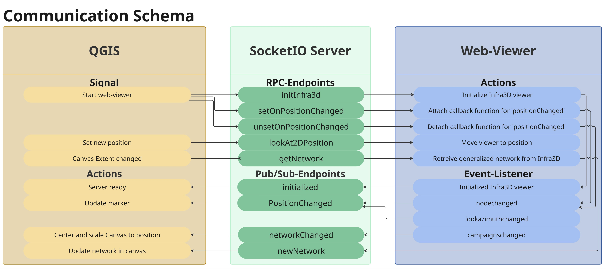
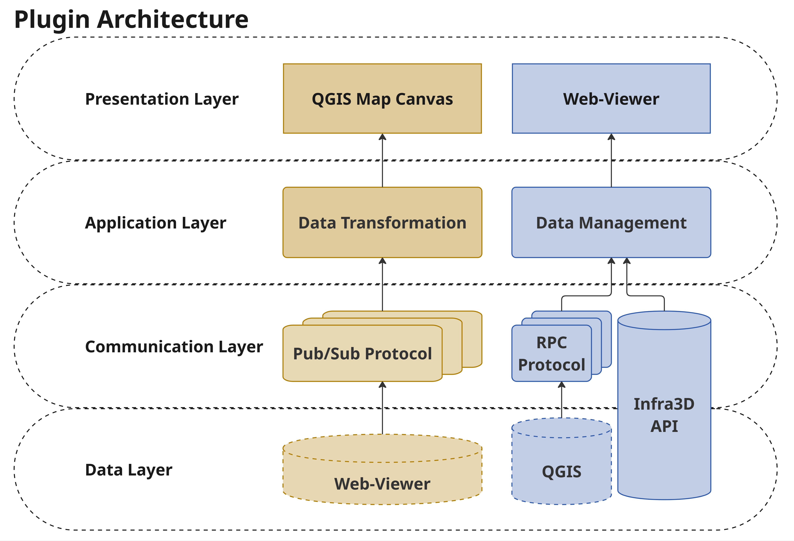

# infra3D plugin

## Table of Contents

- [1. Usage](#1-usage)
  - [1.1 QGIS-Part](#11-qgis-part)
  - [1.2 Interactivity between QGIS and Infra3D](#12-interactivity-between-qgis-and-infra3d)
  - [1.3 Basic Infra3D viewer](#13-basic-infra3d-viewer)
- [2. Architecture](#2-architecture)
  - [2.1 Components](#21-components)
    - [2.1.1 QGIS-Part](#211-qgis-part)
    - [2.1.2 SocketIO Server](#212-socketio-server)
    - [2.1.3 Web-Viewer](#213-web-viewer)
  - [2.2 Exchange Protocols](#22-exchange-protocols)
    - [2.2.1 Remote Procedure Call (RPC)](#221-remote-procedure-call-rpc)
    - [2.2.2 Publish-Subscribe (Pub/Sub)](#222-publish-subscribe-pubsub)
  - [2.3 Event-Listeners](#23-event-listeners)
    - [2.3.1 Event-Listeners in QGIS](#231-event-listeners-in-qgis)
    - [2.3.2 Event-Listeners in web-viewer](#232-event-listeners-in-web-viewer)
- [3. Dependencies](#3-dependencies)
- [4. Development](#4-development)
- [5. Projectstructure: Infra3DPlugin](#5-projectstructure-infra3dplugin)
- [6. License](#6-license)

## 1. Usage

The Infra3D plugin is a connection between infra3D (https://www.infra3d.com) and QGIS. infra3D runs in a browser and the plugin allows to set and move the camera position in QGIS as well as to show the current camera position and direction in QGIS. The plugin supports the following actions:

### 1.1 QGIS-Part

- **Enable infra3D** opens the infra3D application in the browser and etablishes the connection between QGIS and the browser application.
- **Settings** opens the settings dialog. The settings currently provide no functionality. Might be reused to select synchronizable layers (QGIS -> infra3D).
- **Set infra3D position** activates the tool to set a position in QGIS. One activated, click on the QGIS map canvas, the position will update in infra3D.
- **Zoom to marker** sets the map extent to the position where the marker is.

### 1.2 Interactivity between QGIS and Infra3D

- **QGIS → infra3D:** Changing the position in QGIS (using the `Set infra3D position`-button) updates the position in infra3D.
- **infra3D → QGIS:** Changing the position of the viewer (infra3D) updates the position on the QGIS map canvas.
- **infra3D → QGIS:** Changing the viewing direction of the viewer (infra3D) updates the orientation on the QGIS map canvas.
- **infra3D → QGIS:** The network is fetched and updated in the QGIS map canvas each time a new campaign is selected.

### 1.3 Basic infra3D viewer

- **Interactive Login:** To sign in and access the projects, the [interactive login](https://developers.Infra3D.com/javascript-api/examples/authenticate-interactively) is used. If possible, the last login is automatically extended to prevent the user from having to log in again each time.
- **Project Selection:** Once logged in, all projects allocated to the user are displayed in a collapsable project selection view. Toggling the project view is enabled by a button, indicated by a `Folder`-Icon.
- **infra3D viewer:** By selecting a project from the `Project Selection`, the infra3D viewer is loaded and the project selection is closed. The viewer displays all components of the infra3D viewer plus the afore-mentioned project selection modal.

## 2. Architecture

The plugin's architecture comprises three main components, two exchange protocols, and several event-listeners, calling respective endpoints.

The figure below shows the components and the communication between them.


The architecure (software-layers) are shown in the subsequent figure. Both QGIS and the web-viewer can be seen as presentation layers as well as data layers. Both display data (presentation layer) but also hold information (data layer). The infra3D JavaScript API from iNovitas is a communication layer (API) and accesses its own data layer.


### 2.1 Components

To optimize the workflow of using GIS-data in combination with infra3D, elements like the viewers pose or geodata-layers must be synchronized between the QGIS-part of the plugin and the web-viewer. The synchronization between them is established using a server. Below the three mentioned components are explained further.

#### 2.1.1 QGIS-Part

QGIS-part refers to the interaction with the QGIS UI. It comprises the [four buttons](#11-qgis-part) of the plugin as well as the map canvas and all 'background'-computations.

#### 2.1.2 SocketIO Server

The SocketIO server acts as a bridge between the QGIS-part of the plugin and the web-viewer part. It hosts the required [exchange protocols](#22-exchange-protocols) and endpoints. By default, the server is booted `localhost:5000` when the button [`Set infra3D position`](#11-qgis-part) is pressed.

#### 2.1.3 Web-Viewer

The web-viewer comprises the login-screen, the project selection, and the main viewer. It extends the basic functionality of Infra3D by a further UI-element which allows for easy switching between projects.

### 2.2 Exchange Protocols

The use case of this plugin necessitates the communication between the QGIS-part of the plugin and the web-viewer. For the communication purpose, a web-server is built upon Flask using SocketIO. The plugin requires both one-sided and double-sided communication. Therefore, two messaging/exchange protocols are implemented.

#### 2.2.1 Remote Procedure Call (RPC)

RPC is one way of implementing a client.server model. Communication begins when the client sends a request to a known server and waits for a response. In the request, the client specifies which function is to be executed and which parameters are to be used. The server processes the request and sends the response back to the client. After receiving the message, the client can continue processing (see also [https://datatracker.ietf.org/doc/html/rfc1057](https://datatracker.ietf.org/doc/html/rfc1057)).

#### 2.2.2 Publish-Subscribe (Pub/Sub)

Pub/Sub is a scalable, asynchronous messaging service that decouples services producing messages from services processing those messages. The Pub/Sub-environment contains publishers (sending the messages) and subscribers (receiving the messages). Other than RPC Pub/Sub the communication is asynchronous and the the publisher does not need to know the receiver. Pub/Sub is a one-sided communication, meaning the receiving end does not answer. Further information can be found here: [https://docs.cloud.google.com/pubsub/docs/overview](https://docs.cloud.google.com/pubsub/docs/overview)

### 2.3 Event-Listeners

Event-listeners and Signals attach functions (virtual) buttons. In javascript, event-listeners are used to add functions to a button or a state. In python (PyQt), signals are used for the same purpose.

#### 2.3.1 Event-Listeners in QGIS

Python does not have "event-listeners". The pyqtSignal class however, works similarly to event-listeners as they are fired upon external triggering. The five signals are handled in the file `infra3d_client.py`. The functions are mounted to the signals in the file `infra3d_plugin.py`.

- **webapp_loaded:** Listens to web-viewer-event `loaded` and starts startup-phase.
- **webapp_initialized:** Listens to web-viewer-event `initialized` and ends startup-phase.
- **connection_failed:** Fired when initialization of web-app fails, shows error message and ends startup-phase.
- **position_changed:** Listens to web-viewer-event `positionChanged` and updates marker pose.
- **azimuth_changed:** Listens to web-viewer-event `lookAzimuthChanged` and updates marker orientation.

#### 2.3.2 Event-Listeners in web-viewer

In the web-viewer five event-listeners are mounted upon successful initialization of infra3D, sending states to QGIS using the `Pub/Sub-Protocol`:

- **Click-Event on Project Cards:** Initializes the viewer with the selected project. The signal remains in the web-viewer.
- **Initialized:** This event is fired once the viewer is loaded. It sends a Pub/Sub message to QGIS, indicating successful connection.
- **campaignschanged:** Each time a new project is selected, a function is triggered that fetches the infra3D network and sends it as GeoJSON to QGIS using the Pub/Sub-Protocol.
- **nodechanged:** If the viewer's position changes, a Pub/Sub-message containing the two-dimensional camera pose (Lon, Lat, Azimuth) is emitted to QGIS. (The Coordinates are transformed to `EPSG:2056` in QGIS).
- **lookazimuthchanged:** If the viewer's orientation (viewing direction) changes, a Pub/Sub-message containing the two-dimensional camera pose (Lon, Lat, Azimuth) is emitted to QGIS. (The Coordinates are transformed to `EPSG:2056` in QGIS).

The Web-viewer listens to four server-routes using the `RPC-protocol`:

- **initInfra3d:** Initializes infra3D in the web-viewer.
- **lookAt2DPosition:** Receives the new camera position and updates the viewer.

## 3. Dependencies

Generate wheel files for dependencies:

```bash
pip wheel -r requirements.txt -w dependencies/wheels
```

Install dependencies with wheels:

```bash
pip install --no-index --find-links dependencies/wheels/ -r requirements.txt
```

Install dependencies with wheels into `dependencies/`:

```bash
pip install --no-index --find-links dependencies/wheels/ --target dependencies/site-packages -r requirements.txt
```

## 4. Development

Create a virtual environment:

```bash
virtualenv --python=/usr/bin/python3 --system-site-packages .venv
```

Activate virtual environment:

```bash
source .venv/bin/activate
```

Install requirements:

```bash
pip install -r requirements.txt
```

Test plugin in QGIS:

```bash
source .venv/bin/activate
# We have to start QGIS within the python env because
# we need the dependencies that are only available there.
qgis
```

Generate tranlation files:

```bash
lupdate src/infra3d_client.py src/infra3d_layer_utils.py src/infra3d_map_tool.py src/infra3d_plugin.py src/infra3d_settings_loarule.py src/infra3d_settings.py ui/settings.ui -ts i18n/infra3d_de.ts
lrelease i18n/infra3d_de.ts -qm i18n/infra3d_de.qm
```

## 6. License

This project is licensed under GNU General Public License, version 2. See [LICENSE](./LICENSE).
